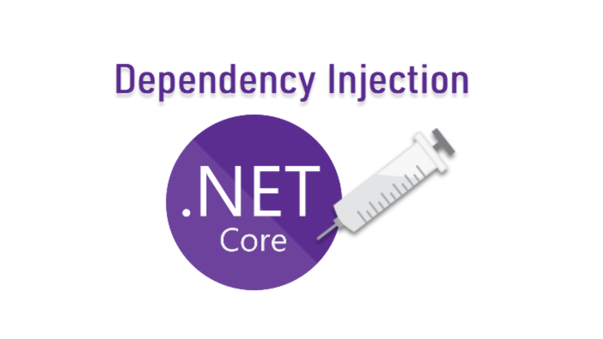

Full Tutorial :[ https://medium.com/@cydexcode/building-a-tree-n-tier-architecture-project-in-net-core-8-web-api-100dddc5cfd9
](https://medium.com/@cydexcode/dependency-injection-in-net-core-8-823ff2f9aff4)

## Check Out My Blog 

- **Blog (Medium):** [https://medium.com/@cydexcode](https://medium.com/@cydexcode)

# Dependency Injection in .NET Core 8 Web API

This repository contains a comprehensive guide on implementing Dependency Injection (DI) in a .NET Core 8 Web API project. Dependency Injection is a crucial design pattern in software development, enhancing modularity, testability, and maintainability of codebases.

## Tutorial Highlights:
- **Step-by-step Guide**: Learn how to transform a tightly coupled .NET MVC application into a loosely coupled one using Dependency Injection.
- **Clear Separation of Concerns**: Establish a shared layer for defining interfaces, promoting a standardized way to interact with application components.
- **Flexible Service Layer Implementation**: Implement interfaces in the service layer to provide flexibility in data manipulation without affecting other parts of the application.
- **Constructor Injection**: Inject dependencies into controllers, adhering to the Dependency Inversion Principle and enabling easier unit testing.
- **Configuration of Dependency Injection**: Centralize the registration of services and their implementations for clear and consistent dependency management.

## Benefits of Dependency Injection:
- **Improved Maintainability**: Enhance the modularity of the codebase, making it easier to understand and modify.
- **Enhanced Testability**: Facilitate comprehensive unit testing by allowing dependencies to be mocked or substituted.
- **Increased Scalability**: Promote the integration of new features or modules as the application evolves over time.
- **Better Code Quality**: Adhere to principles of separation of concerns and dependency inversion, leading to fewer bugs and easier debugging processes.

Follow the tutorial to harness the power of Dependency Injection and elevate the quality of your .NET Core 8 Web API projects!

---

## Check Out My Blog 

- **Blog (Medium):** [https://medium.com/@cydexcode](https://medium.com/@cydexcode)

   add below description to  above readme code file 
Search
Write

Sachinthana Buddhika
Dependency Injection in .NET 8
Sachinthana Buddhika
Sachinthana Buddhika

5 min read
·
3 days ago

I have already made an article for dependency injection concept. Before this .NET example you can read that article to understand it better.

Here is the blog post:https://medium.com/@cydexcode/what-is-dependency-injection-di-fdcb15e04755

---

Thank you for your support!

🚀 Follow CydexCode on YouTube , TikTok , Linkedin , Facebook , and Telegram for more exciting content! 🎉📱💻📢

